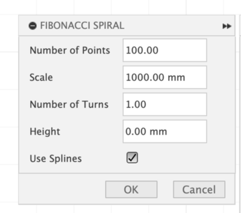
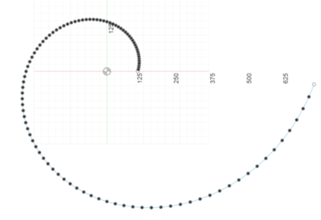

# Fibonacci Spiral Generator for Fusion 360

This script creates a customizable Fibonacci spiral in Fusion 360. You can control the size, number of turns, height, and choose between lines or splines for the curve.

## Features

- Generate Fibonacci spirals with customizable parameters:
  - Scale (size)
  - Number of points
  - Number of turns
  - Height (Z-axis ramping)
  - Option to use lines or splines

## Installation

1. Clone or download this repository
2. Copy the `Fib.py` file to your Fusion 360 scripts folder:
   - Windows: `%appdata%\Autodesk\Autodesk Fusion 360\API\Scripts\`
   - macOS: `~/Library/Application Support/Autodesk/Autodesk Fusion 360/API/Scripts/`

## Usage

1. Open Fusion 360
2. Go to the "Scripts and Add-Ins" panel (Tools > Scripts and Add-Ins)
3. Find "Fibonacci Spiral" in the list
4. Click "Run"



### Parameters

- **Number of Points**: Controls the smoothness of the spiral (10-1000)
- **Scale**: Controls the overall size of the spiral in millimeters (0.1-1000mm)
- **Number of Turns**: Controls how many complete rotations the spiral makes (0.1-10)
- **Height**: Controls how much the spiral ramps up in the Z direction (0-1000mm)
- **Use Splines**: Checkbox to toggle between lines and smooth splines



### Example Settings

- Flat spiral: Scale=100mm, Points=100, Turns=1.0, Height=0mm
- Tall spiral: Scale=100mm, Points=200, Turns=2.0, Height=50mm
- Wide spiral: Scale=200mm, Points=50, Turns=0.5, Height=25mm

## Development

To run the tests:
```bash
python Fib.py test
```

## License

This project is open source and available under the MIT License.

## Contributing

Feel free to submit issues and enhancement requests! 